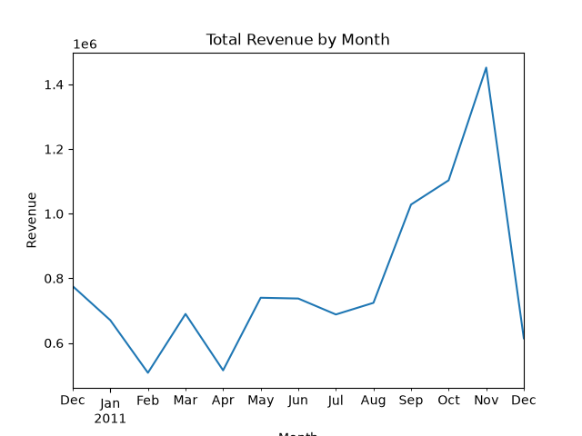

# EECE 5644 Mini Project 1

## Overview

The first project in EECE 5644. Cobblestone Gifts is looking to run a sales review and needs to convert the raw output of their order system into useable data for a sales review. The raw data is in a CSV file and contains information about orders, customers, and products. This project takes the raw data and cleans it to allow the company to perform the sales review effectively.

## Findings

A one page report is available in `EECE Mini Project 1 Report.pdf` that summarizes the findings of the analysis. The report includes visualizations and insights derived from the cleaned dataset. The largest insights are the top 1% of customers accounting for 32% of all revenue, and the holiday season accounting for a significant increase in revenue compared to a typical month. 

## Downloading Dataset From Kaggle
The raw data is already present in this repo [data.csv](data.csv), however, if needed, the dataset can be downloaded from [kaggle.com](https://www.kaggle.com/datasets/carrie1/ecommerce-data). I have extracted the [data.csv](data.csv) from the unzipped files and moved it to the project directory.

## Running the Jupyter Notebook

1. set up environment using [requirements.txt](requirements.txt)
    - Run `pip install -r requirements.txt` to install the required packages.
2. Open [miniproject1.ipynb](miniproject1.ipynb)
3. Run all cells in the notebook
    - Note that the for-loop block may take some time to complete and it can be skipped if you want to save time. The action it performs is redundant, and the cell only exists for demonstration purposes. The cleaned dataset is already present in the repo as [clean_online_retail.csv](clean_online_retail.csv).